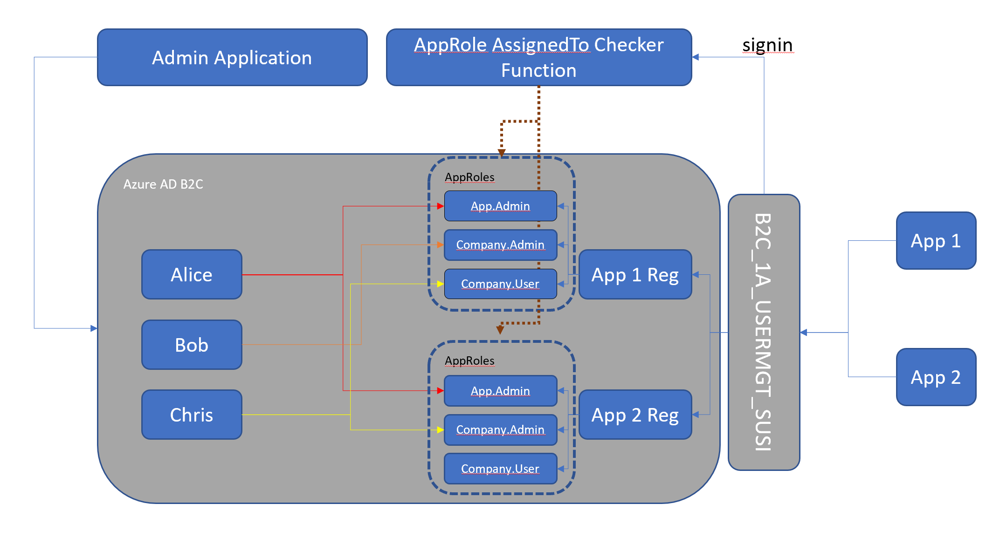

# Azure AD B2C User Management Sample

This sample uses MS Graph along with B2C Custom Policies to manage various user access to applications.

This diagram helps describe the relationship between policies, MS Graph, and admin/client apps:

## Repo Contents
This repo holds a number of projects. Here's a high level overview of the various top level folders/projects

- Administration Application
  
  This application is a Blazor Web Assembly Hosted app and consists of three projects:

  1. [Shared Project](./agileways.usermgt.admin.client/Shared) is a DOTNETCORE 5.0 shared DLL that is used by both the Client and Server projects. This contains common model classes specifically for Azure AD objects.
  1. [Server Project](./agileways.usermgt.admin.client/Server) is an ASPNETCORE 5.0 web api project that is invoked by the Client app. Controllers hold server-side logic invoked by the Client.
  1. [Client Project](./agileways.usermgt.admin.client/Client) is a Blazor Web Assembly (Hosted) ASPNETCORE 5.0 app. This app invokes various Server controllers for managing user access to Azure AD objects.

- [Sign In Role Resolver](./agileways.usermgt.api)

  This Web API project is invoked by B2C's Custom Policy during sign-in in order to resolve the user's Roles for a given application ID. The `role` claim returned is a string array of role names. This claim is included in the user's token upon successful sign-in.

- [B2C Custom Policies](./policies/SocialAndLocalAccounts)

  Custom Policies for B2C. These policies are taken from the Custom Policy Starter Pack for Social and Local Accounts, and include specific policies (in the [UserMgt](./policies/SocialAndLocalAccounts/UserMgt) subfolder) that are specific to the Sign UP and Sign IN logic needed for role resolution.

- [Sample Client App](./clientApps/clientApp1)

  Sample Blazor WebAssembly Hosted application (including standard Server, Client, and Shared folders) that can be used to test the roles applied to a user. Of note is that the [Client's Program.cs](./clientApps/clientApp1/Client/Program.cs) file includes Authorization Requirements and AuthorizationHandler implementations to show how to check for role claims. Also check out the Client's Razor Page for [UserStuff.razor](./clientApps/clientApp1/Client/Pages/UserStuff.razor) to show an Authorization Policy for multiple role access, and the Razor Page for [AppAdminStuff.razor](./clientApps/clientApp1/Client/Pages/AppAdminStuff.razor) for checking for admin-type roles only.

